# LR6
Лабораторная работа №6

# Цель лабораторной работы:

Изучение базовых возможностей системы
управления версиями, опыт работы с Git Api, опыт работы с локальным и
удаленным репозиторием.

# Порядок выполнения работы:

*1. Создать аккаунт на сайте GitHub.*

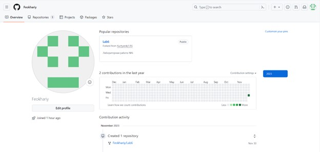

*2. Сделать копию в личное хранилище из
https://github.com/Kurtyanik/LR6/ (Fork).*

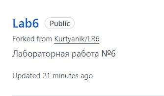

*3. Установить Git (https://git-scm.com/).*

*4. После установки настроить клиент git, введя имя пользователя (Группа
Фамилия И.О.) и email.*

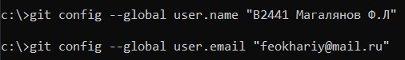

*5. Клонировать свой личный удалённый репозиторий на компьютер.*

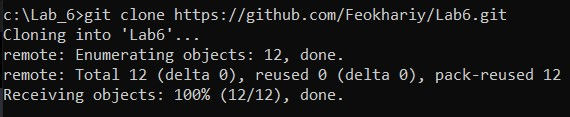

*6. Добавить файл через интерфейс GitHub. Подтянуть изменения в
локальный репозиторий.
Работу продолжать локально.*

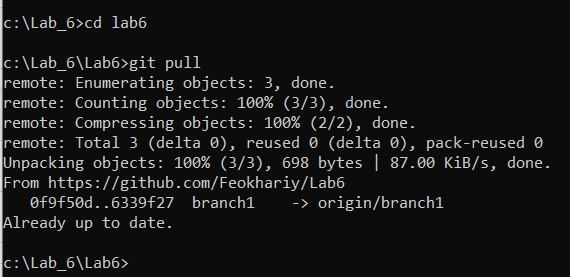

*7. Получить историю операций для каждой из веток.*

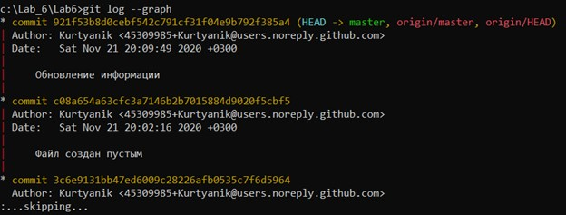

*8. Просмотреть последние изменения.*

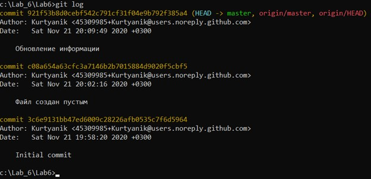

*9. Выполнить слияние в ветку master, разрешив конфликт (можно
использовать специальные редакторы или графический интерфейс git).*

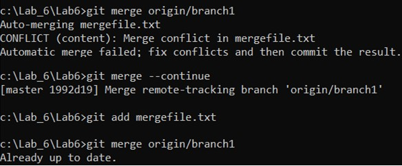

*10. Удалить побочную ветку после успешного слияния.*

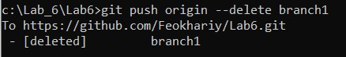

*11. Сделать изменения и зафиксировать их, оставляя комментарии,
несколько раз.*

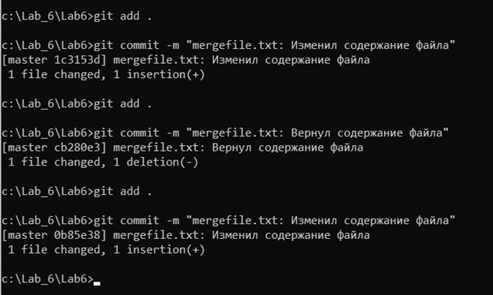

*12. Сделать откат коммита.*

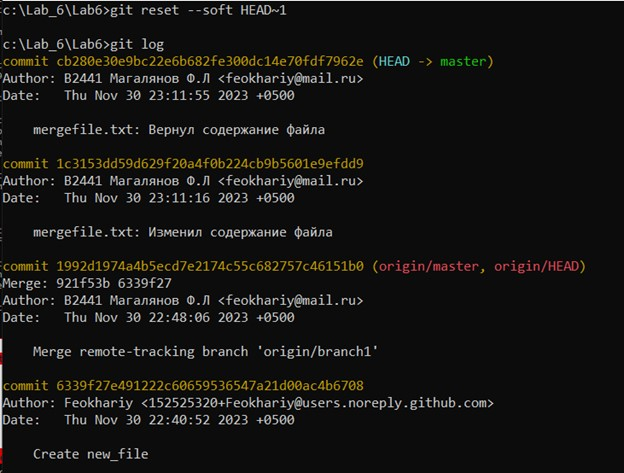

*13. Создать ветку для отчёта.*

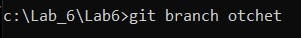

*14. Начать оформлять отчёт в файле README.md*

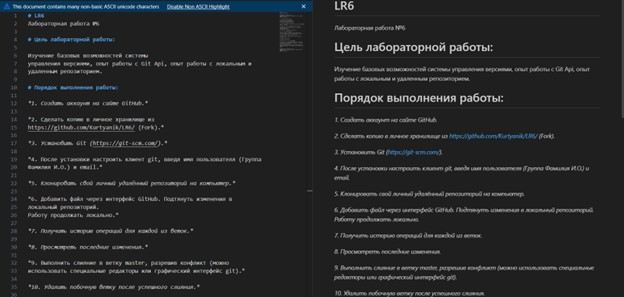

*15. Получить историю операций в форматированном виде (сокращённый
хэш + дата + имя автора + комментарий). Добавить её в отчёт и сделать
финальную фиксацию изменений.*

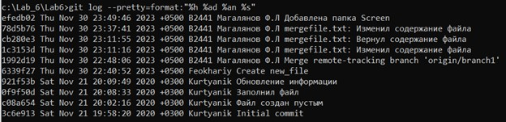

*16. Отправить локальные изменения в сетевое хранилище GitHub (если
делаете работу постепенно, то синхронизацию проводить в конце рабочего
сеанса)*

git push -u origin 

# Вывод:

Были изучены базовые возможности системы управления версиями, был получен опыт работы с Git Api, опыт работы с локальным и удаленным репозиторием.